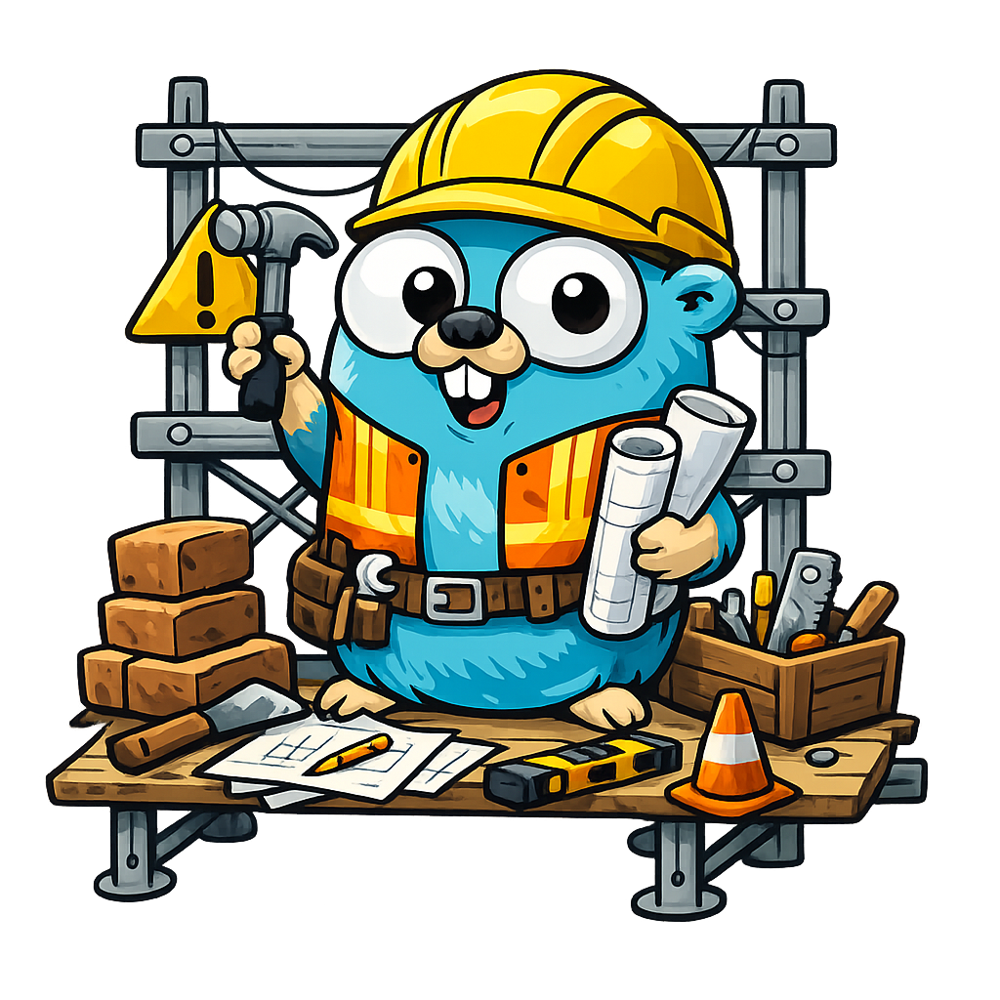

# forge

`forge` is a small, opinionated Go CLI for quickly scaffolding new Go projects.

It creates a sensible project layout, initializes Go modules and git, and gives you a clean starting point so you can focus on writing code instead of boilerplate.



---

## Why forge?

When starting a new Go project, you often repeat the same steps:

- Create a directory structure
- Set up `cmd/<name>/main.go`
- Initialize a Go module
- Initialize git
- Create basic project files

`forge` automates this without trying to be clever.  
No magic, no YAML-heavy configuration, no frameworks — just a solid starting point.

---

## What it creates

Given a project name, `forge` generates:

### Folders
```bash
Archive/
cmd/<project-name>/
pkg/
internal/
doc/
scripts/
dist/
```

### Files
```bash
README.md
LICENSE
scripts/CICD.sh
scripts/find_unused_exports.sh
scripts/get_cmd_commands_for_help_file.zsh
cmd/<project-name>/main.go
```

The generated `main.go` is intentionally minimal, idiomatic, and ready to run.

---

## Example

```bash
$ forge
What is the name of your project?
example
```

### Output
example
├── ./Archive
├── ./cmd
│   └── ./cmd/wonderful
│       └── ./cmd/wonderful/main.go
├── ./dist
├── ./doc
├── ./go.mod
├── ./internal
│   └── ./internal/cli
│       └── ./internal/cli/cli.go
├── ./LICENSE
├── ./pkg
├── ./README.md
└── ./scripts
    ├── ./scripts/CICD.sh
    ├── ./scripts/find_unused_exports.sh
    └── ./scripts/get_cmd_commands_for_help_file.zsh

## Philosophy

forge is designed to be:

Explicit — you can see exactly what it creates

Predictable — no hidden behavior

Go-idiomatic — standard layouts, standard tools

Hackable — easy to extend as you learn

This project exists primarily as a personal productivity aid. If it’s useful to others, that’s a bonus.

## Installation

For now, build:
go install github.com/jonathon-chew/forge/cmd/forge@latest

## Status

This project is early and evolving.

Planned improvements include:

Better command structuring and error handling
Optional git / Go module initialization flags
Configurable templates
Non-interactive mode (forge new <name>)

## Acknowledgements

The Go gopher is based on the Go community mascot, originally designed by Renée French.
